# WORKFLOWS — 0xkey Enclave KeyOps 全员协同时序

> **范围**：本文档是 **Coordinator-only**。Manifest / Share / Builder
> agent 不应读它（skill boundary 由 `tools/sync-skills.py` 的
> `COORDINATOR_ONLY_FILES` 强制：只有 `0xkey-keyops-coordinator` 包内
> 才会出现本文件）。每个单角色 runbook 在 `references/roles/` 下；
> Coordinator 之所以需要这份"全员协同总览"，是因为它是**唯一编排整条
> ceremony 的角色**——所有 fan-out / fan-in 节奏、跨 lane 的依赖、人工
> 门禁的次序都由它决定。
>
> 如果你看到的是 Manifest / Share / Builder agent 的视角，应该回去读
> `references/roles/<your-role>.md` 而不是本文件。

---

## §0 阅读指引：谁该读哪一节

| 你正在做 | 重点读 |
|---|---|
| 第一次操盘 ceremony，要在脑子里建一张全员时序图 | §1 阶段总览 + §2 时序泳道 |
| 已经在某 phase 中间，需要确认下一个 fan-in barrier 是什么 | §4 边界约束 + §5 fan-in barriers |
| 某个角色卡住了 / 出错了 | §6 异常路径与恢复 |
| 想把状态拆给多个 agent 并行执行（例如 5 个 share members 同时跑） | §3 横向 swim-lane + §4 边界约束 |
| 写给非技术干系人的进度同步 | §1 阶段总览（直接抄过去即可） |

---

## §1 阶段总览（高层）

整个 ceremony 分 10 个 phase，编号 0..9。每 phase 都标注谁主导、并行
还是串行、输入与产出，是判断"现在到哪一步"的最快索引：

| Phase | 主导 | 并行 / 串行 | 必需输入 | 本阶段产出 |
|---|---|---|---|---|
| **0. 准备** | Builder ‖ Coordinator ‖ 所有 member | **全部并行** | 各自本机环境 | qos_client + sha / Coordinator config.json + kubectl allowlist / 各 member 的 `role_init.py` 工作区 |
| **1. Roster 发布** | Coordinator | 串行 | 报名名单 + 两份 threshold + `dr-key.pub` | `shared/member-roster.json` 广播 |
| **2. Key 生成** | Manifest × M ‖ Share × N | **并行**（确认 alias 后） | roster 里自己的 `(alias, member_index)` + qos_client | 各自 `outbox/{alias}.pub`；私钥在 YubiKey 或外部 vault |
| **3. 公钥汇聚** | Coordinator | **fan-in 等待** | 所有 `.pub` + 两份 `quorum_threshold` + `dr-key.pub` | `shared/{manifest,share,patch}-set/` 满员；`doctor coordinator` 全绿 |
| **4. Genesis** | Coordinator | 串行（人工门禁）| Phase 3 输出 + 健康的 qos-genesis Deployment | `quorum_key.pub` + `genesis-output-*.tgz`（每人一份 wrapped share） |
| **5. Share extract** | Share × N | **并行**，全员回报后 fan-in | `genesis-output-*.tgz` + 自己的 secret/YubiKey | 各自 `.share`（写到**外部 vault**，**不**回传 Coordinator）；向 Coordinator 报告"已 extract" |
| **6. Manifest review + approve** | Coordinator → Manifest × M | Coordinator 串行；Manifest 之间**并行** | `manifest-review-*.tgz` | 各自 `outbox/approval-{alias}.tgz` → Coordinator 收齐 |
| **7. boot-standard + attestation** | Coordinator | 串行（人工门禁）| 达到 manifest threshold 的 approvals + envelopes | 五个服务 `WaitingForQuorumShards` + `share-request-*.tgz` |
| **8. Reencrypt** | Share × N | **并行**，全员回报后 fan-in | `share-request-*.tgz` + 自己的 `.share` + secret/YubiKey | 各自 `outbox/wrapped-share-{svc}-{alias}.tgz` |
| **9. post-share + verify** | Coordinator | **按服务串行**（顺序敏感）| 达到 share threshold 的 wrapped shares | 五个服务 `QuorumKeyProvisioned` + `:8081/health` + 业务 smoke |

---

## §2 详细时序泳道（Mermaid sequenceDiagram）

最权威的一张图。每条 `par` 块表示真并行（actor 内部也并行），每个
`rect` 表示一个 phase。

```mermaid
sequenceDiagram
    autonumber
    participant B as Builder
    participant C as Coordinator
    participant M as Manifest Set<br/>(M1..Mₘ)
    participant S as Share Set<br/>(S1..Sₙ)

    rect rgb(245,245,245)
      note over B,S: Phase 0 — 准备（全部并行）
      par
        B->>B: 出 qos_client + .sha256 + qOS revision
      and
        C->>C: 收集 AWS/EKS/overlay/期望 sha → init workspace<br/>(config.json, shared/, inbox/, outbox/, bundles/)
      and
        M->>M: role_init.py --role manifest --alias {m}
      and
        S->>S: role_init.py --role share --alias {s} --member-index {n}
      end
      B-->>C: qos_client 包
      B-->>M: qos_client 包
      B-->>S: qos_client 包
    end

    rect rgb(235,245,255)
      note over C: Phase 1 — 发布 Roster（串行）
      C->>C: 写 shared/member-roster.json<br/>(alias, member_index, 两份 quorum_threshold)
      C-->>M: roster + 各自分配的 alias
      C-->>S: roster + 各自分配的 (alias, member_index)
    end

    rect rgb(235,255,235)
      note over M,S: Phase 2 — Key 生成（M 和 S 并行；set 内每个成员也并行）
      par Manifest 成员各自并行
        M->>M: key yubikey-provision (或 file-generate)<br/>触摸×2 → outbox/{alias}.pub
      and Share 成员各自并行
        S->>S: key yubikey-provision (或 file-generate)<br/>触摸×2 → outbox/{alias}.pub
      end
      M-->>C: 各自 {alias}.pub
      S-->>C: 各自 {alias}.pub
    end

    rect rgb(235,245,255)
      note over C: Phase 3 — 公钥汇聚（fan-in barrier）
      C->>C: 汇入 shared/{manifest|share|patch}-set/{alias}.pub<br/>+ shared/dr-key.pub<br/>+ 写两份 quorum_threshold
      C->>C: doctor coordinator — roster gate 全绿
    end

    rect rgb(255,245,235)
      note over C: Phase 4 — Genesis（串行 + 人工门禁）
      C->>C: ceremony genesis-boot<br/>→ genesis-output/quorum_key.pub<br/>+ 每人 wrapped share
      C->>C: bundle create --kind genesis-output
      C-->>S: genesis-output-*.tgz + .sha256
    end

    rect rgb(235,255,235)
      note over S: Phase 5 — Share extract（并行，全员回报后 fan-in）
      par
        S->>S: ceremony share-extract --yubikey<br/>触摸×1 → 外部 vault/{alias}.share
      end
      S-->>C: "我已 extract"（不回传 .share）
    end

    rect rgb(255,245,235)
      note over C,M: Phase 6 — Manifest review + approve
      C->>C: manifest generate → bundle create --kind review
      C-->>M: manifest-review-*.tgz + .sha256
      par Manifest 成员各自并行 review
        M->>M: manifest approve --yubikey<br/>触摸×1 → outbox/approval-{alias}.tgz
      end
      M-->>C: 各自 approval bundle
      C->>C: 解开 approval → manifest/approvals/{svc}/<br/>→ manifest envelope
    end

    rect rgb(255,235,235)
      note over C: Phase 7 — boot-standard + attestation（人工门禁）
      C->>C: deploy render → (人工确认) → deploy apply
      C->>C: ceremony boot → ceremony attestation
      C->>C: bundle create --kind share-request
      C-->>S: share-request-*.tgz + .sha256
    end

    rect rgb(235,255,235)
      note over S: Phase 8 — Reencrypt（并行，全员回报后 fan-in）
      par
        S->>S: ceremony reencrypt --yubikey<br/>触摸×2 → outbox/wrapped-share-{svc}-{alias}.tgz
      end
      S-->>C: 各自 wrapped-share bundle
    end

    rect rgb(255,235,235)
      note over C: Phase 9 — post-share + verify（按服务串行）
      loop 每个 service (顺序敏感, e.g. m2,m1)
        C->>C: ceremony post --post-global-order {ord}
      end
      C->>C: verify (Pod Ready + QuorumKeyProvisioned<br/>+ :8081/health + 业务 smoke)
    end
```



---

## §3 横向 Swim-Lane（Mermaid flowchart）

每个 lane = 一种角色，按时间从左到右。比 §2 更直观地看出"每个 lane
在每个时间段做什么、跨 lane 依赖在哪"：

```mermaid
flowchart LR
    %% ============== BUILDER ==============
    subgraph BUILDER["Builder"]
      direction LR
      B0[Phase 0<br/>build qos_client<br/>+ .sha256<br/>+ qOS revision]
    end

    %% ============== COORDINATOR ==============
    subgraph COORDINATOR["Coordinator"]
      direction LR
      C0[Phase 0<br/>init workspace<br/>config.json]
      C1[Phase 1<br/>publish roster<br/>+ thresholds + dr-key.pub]
      C3[Phase 3<br/>collect .pub<br/>doctor coordinator]
      C4[Phase 4<br/>genesis-boot<br/>→ genesis-output-*.tgz]
      C6a[Phase 6a<br/>manifest generate<br/>→ review-*.tgz]
      C6b[Phase 6b<br/>collect approvals<br/>→ envelope]
      C7[Phase 7<br/>deploy apply<br/>boot + attestation<br/>→ share-request-*.tgz]
      C9[Phase 9<br/>post-share per svc<br/>verify]
      C0 --> C1 --> C3 --> C4 --> C6a --> C6b --> C7 --> C9
    end

    %% ============== MANIFEST SET ==============
    subgraph MSET["Manifest Set (M1..Mₘ 内部并行)"]
      direction LR
      M0[Phase 0<br/>role_init manifest]
      M2[Phase 2<br/>key gen → .pub]
      M6[Phase 6<br/>review + approve<br/>触摸×1<br/>→ approval-*.tgz]
      M0 --> M2 --> M6
    end

    %% ============== SHARE SET ==============
    subgraph SSET["Share Set (S1..Sₙ 内部并行)"]
      direction LR
      S0[Phase 0<br/>role_init share<br/>--member-index n]
      S2[Phase 2<br/>key gen → .pub]
      S5[Phase 5<br/>share-extract<br/>触摸×1<br/>→ 外部vault/.share]
      S8[Phase 8<br/>reencrypt<br/>触摸×2<br/>→ wrapped-share-*.tgz]
      S0 --> S2 --> S5 --> S8
    end

    %% ============== 跨 lane 依赖 ==============
    B0 -.qos_client + sha.-> C0
    B0 -.qos_client.-> M0
    B0 -.qos_client.-> S0
    C1 -.roster + alias.-> M2
    C1 -.roster + (alias,idx).-> S2
    M2 -.{alias}.pub.-> C3
    S2 -.{alias}.pub.-> C3
    C4 -.genesis-output-*.tgz.-> S5
    S5 -.我已 extract.-> C6a
    C6a -.review-*.tgz.-> M6
    M6 -.approval-*.tgz.-> C6b
    C7 -.share-request-*.tgz.-> S8
    S8 -.wrapped-share-*.tgz.-> C9

    classDef parallel fill:#eaffea,stroke:#3a8
    classDef serial fill:#ffeada,stroke:#c63
    class BUILDER,MSET,SSET parallel
    class COORDINATOR serial
```

---

## §4 并行 / 串行边界（不变量清单）

> 这一节是 ceremony 调度的**硬约束**。任何"为了赶时间"的优化必须先证明
> 没破坏下面任何一条；否则会出现 quorum_key 半成型、approval 数不足、
> post-share 顺序错乱等不可恢复事故。

| # | 边界 | 类型 | 不可越过的原因 |
|---|---|---|---|
| 1 | Phase 0 内 4 类 actor | **并行** | 互不依赖 |
| 2 | Phase 2 同 set 内 / 跨 set 全员 | **并行** | 每个 alias 各自独立生成；任何一个 alias 卡住不阻塞其他 |
| 3 | Phase 3 → Phase 4 | **fan-in 串行** | Genesis 需要 **100%** 公钥到齐 + thresholds + `dr-key.pub`；少一个 alias 直接拒绝 boot |
| 4 | Phase 4 → Phase 5 | 串行 | Share extract 需要 `genesis-output-*.tgz` 中**自己的** wrapped share |
| 5 | Phase 5 → Phase 6 | **fan-in 串行** | `references/roles/coordinator.md` 明确："Wait for each Share member to confirm they ran ceremony share-extract successfully **before proceeding to manifest generation**" |
| 6 | Phase 6 内 manifest members | **并行** | 各自签自己 alias 的 approval |
| 7 | Phase 6 → Phase 7 | **fan-in + 人工门禁** | approvals 数需达 `manifest threshold`；`deploy apply` 需要操作员输入确认短语 |
| 8 | Phase 7 → Phase 8 | 串行 | Reencrypt 需要 `share-request-*.tgz`（含 attestation doc） |
| 9 | Phase 8 → Phase 9 | **fan-in 串行** | post-share 需达 `share threshold` 的 wrapped shares |
| 10 | Phase 9 内五个服务 | **按服务串行**（顺序敏感）| `post-global-order` 已知不能乱；详见 §6 与 SECURITY.md §6 |

---

## §5 关键 fan-in barriers（Coordinator 的等待点）

Coordinator 在 ceremony 里有 **4 个明确的"等所有人"barrier**。任何
agent / 自动化要并行加速 ceremony，加速的都只能是 barrier 之间的
phase，barrier 本身永远等齐：

| Barrier | 等谁 | 等到什么程度才能往下走 | 失败时的恢复 |
|---|---|---|---|
| **B1**（Phase 3）| 全员 `.pub` | **100%** 到齐（任何一个 `.pub` 缺失或与 roster 不匹配，`doctor coordinator` 会拒绝继续）| 看 §6.1 |
| **B2**（Phase 5）| 所有 share members 回报 "已 extract" | **100%** 回报（一人没 extract，强行进 Phase 6 会让该 share 永远拿不到 wrapped share 的解封路径）| 看 §6.3 |
| **B3**（Phase 6 → 7）| approval bundles | 数量 ≥ `manifest threshold`（其余成员失联可以放弃，但不能调低 threshold）| 看 §6.4 |
| **B4**（Phase 8 → 9）| wrapped-share bundles | 数量 ≥ `share threshold`（同样不能调低）| 看 §6.5 |

> 注意：B1 与 B2 是 **100%**（无法降级），因为前者会改变 quorum key
> 本身，后者会让某个 share 在 ceremony 期间永远落单；B3 与 B4 是
> **threshold**，可以容忍部分成员失联，但 threshold 本身在
> ceremony 开始后不能改。

---

## §6 异常路径与恢复

满足 SECURITY.md §6 的 `[WORKFLOWS.md](WORKFLOWS.md) §恢复` 链接锚点
（本节标题里的"恢复"即锚点）。

<a id="恢复"></a>

### 6.1 Phase 3 公钥不齐 / alias 错配

| 症状 | 处理 |
|---|---|
| `doctor coordinator` 报某 alias 缺 `.pub` | 单点失败，**不**阻塞 set 内其他人。让该成员重做 Phase 2 并送 `.pub`；其他 phase 不动 |
| `.pub` 文件名与 roster alias 不匹配 | 让成员重新跑 `role_init.py` 时指定**正确** alias；删错 alias 的 `.pub`，重接收 |
| share-set member_index 重复或不连续 | 修 roster + 让冲突成员重做 Phase 2（roster 一旦广播就视为本轮 truth source；不要回头改 roster 字段，要么补缺、要么 abort 整个 ceremony 重发 roster） |

### 6.2 Phase 4 Genesis 失败

| 症状 | 处理 |
|---|---|
| `boot-genesis` 命令本身失败（pod 不健康 / Nitro device plugin 缺失） | 修环境（这不是本 skill 的工作面），修好后**重跑 boot-genesis**——genesis 是幂等的，旧 `genesis-output/` 应该清空后重生成 |
| `boot-genesis` 成功但 `quorum_key.pub` 看着可疑（大小不对 / 不是有效公钥） | 当 P0 事故：保留所有 artifact 不动，让安全负责人介入；不要直接重跑覆盖证据 |

### 6.3 Phase 5 某 share member YubiKey 半完成 / `.share` 落不下

> 这是 2026-05-16 实测最常见的失败路径。详见 SECURITY.md §5.2.1。

| 症状 | 处理 |
|---|---|
| `key yubikey-provision` 时 `FailedToAuthWithMGM` / `FailedToGenerateSelfSignedCert` | 该成员按 SECURITY.md §5.2.1 整盘 `ykman piv reset --force` + 切回 TDES MGM + 重做 Phase 2 + 重新分发新 `.pub`。**因为旧 `.pub` 已经进 manifest-set，必须退到 Phase 3 重 Genesis**（B1 barrier 的代价） |
| `ceremony share-extract` 成功但操作员误把 `.share` 写到 role workdir 里 | 立刻 `chmod 000 + rm`，让该成员重新 extract 到正确的外部 vault 路径；不影响其他 phase（`.share` 本来就不传给 Coordinator） |
| 某 share member 错过 ceremony 窗口 / 失联 | 在 B2 等齐；若长期失联，整个 ceremony abort，按 SECURITY.md "新增成员" 路径补 alias 并重 Genesis |

### 6.4 Phase 6 approvals 不足

| 症状 | 处理 |
|---|---|
| 失联 manifest member 数 ≤ `M − threshold` | 不阻塞——B3 barrier 容忍 threshold 内的缺席，收齐 threshold 个 approval 即可推进 |
| 失联 manifest member 数 > `M − threshold` | 等齐 **或** 启用 `key-forward` 给失联成员发新 alias → 重做 Phase 6（**不能**临时调低 threshold） |
| approval bundle nonce 不匹配 / alias 不对 | 让该成员重做：脚本本身会拒绝错配的 approval；指出错误后让成员用正确 review bundle 重 approve |

### 6.5 Phase 8 wrapped-share 不足

同 §6.4，但门禁是 `share threshold`。

### 6.6 Phase 9 post-share 顺序失败（**最常见的"看似神秘"故障**）

> 已知部分环境 / qOS revision 对 share 接收顺序敏感。以当前
> ceremony 的部署 runbook 或配置记录为准。

| 症状 | 处理 |
|---|---|
| 单个服务 post-share 失败 / 卡 `WaitingForQuorumShards` | 按 `--post-global-order` 文档化顺序**重做该服务 ceremony**（重发 share-request → 收新 wrapped-share → 重 post），不影响其他已 `QuorumKeyProvisioned` 服务 |
| 多个服务都失败 | 优先检查是否 attestation doc 不对（重发 share-request 时漏拿新 attestation），其次再考虑顺序问题 |
| 五个服务有一个永久卡死 | 该服务退回 Phase 7 重 boot；若 attestation 都不变，理论上可只重做该服务的 attestation → share-request → reencrypt → post |

### 6.7 整轮 abort 决策

什么时候应该 abort 整个 ceremony 而不是局部恢复：

1. **Genesis 已完成但 quorum_key.pub 可疑**（§6.2 第二行）：保留证据并 abort
2. **B1 barrier 在 Genesis 已完成后被破坏**：例如发现某个 manifest/share member 的私钥可能已泄露，则该 alias 的整条信任链作废 → 重新 Genesis 是唯一干净路径
3. **同一轮 ceremony 中 qos_client / qOS revision 被换**：SECURITY.md §8 "同一 ceremony 内不更换"，换了直接 abort 本轮

---

## §7 与其他文档的关系

- `SECURITY.md` — 各 phase 的**安全不变量**（路径不外泄、threshold 推荐、
  vault 形态、YubiKey 首次准备清单等）。本文档是"时序"，SECURITY.md 是
  "约束"，两者一起读才完整。
- `PRINCIPLES.md` — 解释为什么 ceremony 必须这样切片（quorum 切分原理、
  PCR 信任、attestation 链）。读完 PRINCIPLES.md 后看本文档会更顺。
- `references/roles/coordinator.md` — 把 §2 / §3 里 Coordinator lane 的每个
  方框拆成具体 `enclave_keyops.py` 命令、state detection 表、phase A→J
  sequencing。本文档不重复那些命令细节。
- `references/roles/{manifest-set-member,share-set-member,builder}.md` —
  各自单角色视角，**不**关心其他 lane 在什么 phase；本文档是 Coordinator
  专属的"全员视图"。
- `references/operator-prompts.md` — 每个角色的 first-turn prompt 模板；
  ceremony 真正开始时各 actor 用它启动各自 agent。
- `tools/sync-skills.py` `COORDINATOR_ONLY_FILES` 元组 — 强制本文档**只**
  落到 `skills/0xkey-keyops-coordinator/` 包内；Manifest / Share / Builder
  agent 加载自己包时根本看不到本文件，这条 skill boundary 是有意为之。
