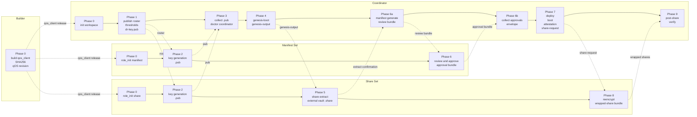

# WORKFLOWS - 0xkey Enclave KeyOps Ceremony Timeline

This document is Coordinator-only. Manifest, Share, and Builder agents should
use their single-role runbooks under `references/roles/` instead. The
Coordinator receives this full timeline because it is the only role that
orchestrates fan-out, fan-in, dependency ordering, and human gates across the
whole ceremony. `tools/sync-skills.py` enforces that only the Coordinator skill
package ships this file.

## 0. Reading Guide

| Situation | Read |
|---|---|
| First time operating a full ceremony | Phase overview and the sequence diagram |
| Already mid-phase and checking the next barrier | Boundaries and fan-in barriers |
| A role is blocked or failed | Failure paths and recovery |
| Splitting work across multiple agents | Swim-lane view and boundary rules |
| Non-technical progress update | Phase overview |

## 1. Phase Overview

| Phase | Lead | Parallelism | Required input | Output |
|---|---|---|---|---|
| 0. Preparation | Builder / Coordinator / all members | parallel | local role environments | `qos_client` + SHA, Coordinator config, member workspaces |
| 1. Roster publication | Coordinator | serial | participant list, thresholds, `dr-key.pub` | `shared/member-roster.json` broadcast |
| 2. Key generation | Manifest x M / Share x N | parallel after roster | assigned alias/index + `qos_client` | each `outbox/<alias>.pub`; private key stays in YubiKey or external vault |
| 3. Public-key fan-in | Coordinator | fan-in | all `.pub`, thresholds, `dr-key.pub` | full `shared/{manifest,share,patch}-set/`; `doctor coordinator` passes |
| 4. Genesis | Coordinator | serial + human gate | Phase 3 output + healthy Genesis target | `quorum_key.pub` + `genesis-output-*.tgz` |
| 5. Share extract | Share x N | parallel, then fan-in | `genesis-output-*.tgz` + holder credential | each member writes `.share` to external vault and confirms extraction (TIME-SENSITIVE: must complete within 3 hours of genesis-boot) |
| 6. Manifest review and approval | Coordinator -> Manifest x M | Coordinator serial, members parallel | `manifest-review-*.tgz` | approval bundles collected by Coordinator |
| 7. boot-standard and attestation | Coordinator | serial + human gate | manifest threshold approvals + envelopes | services reach `WaitingForQuorumShards`; `share-request-*.tgz` |
| 8. Share re-encryption | Share x N | parallel, then fan-in | `share-request-*.tgz` + `.share` + holder credential | wrapped-share bundles + share-set approvals |
| 9. post-share and verify | Coordinator | per-service serial | share threshold wrapped shares | all services `QuorumKeyProvisioned`, `:8081/health`, business smoke |

## 2. Sequence Diagram

```mermaid
sequenceDiagram
    autonumber
    participant B as Builder
    participant C as Coordinator
    participant M as Manifest Set
    participant S as Share Set

    rect rgb(245,245,245)
      note over B,S: Phase 0 - preparation, all lanes parallel
      par
        B->>B: build qos_client, SHA256, qOS revision
      and
        C->>C: collect AWS/EKS/overlay inputs and init workspace
      and
        M->>M: role_init.py with roster alias
      and
        S->>S: role_init.py with roster alias and member index
      end
      B-->>C: operator client release
      B-->>M: operator client release
      B-->>S: operator client release
    end

    rect rgb(235,245,255)
      note over C: Phase 1 - publish roster
      C->>C: write shared/member-roster.json with aliases, indexes, thresholds
      C-->>M: roster and assigned alias
      C-->>S: roster and assigned alias/member_index
    end

    rect rgb(235,255,235)
      note over M,S: Phase 2 - key generation
      par Manifest members
        M->>M: key yubikey-provision or file-generate -> outbox/<alias>.pub
      and Share members
        S->>S: key yubikey-provision or file-generate -> outbox/<alias>.pub
      end
      M-->>C: <alias>.pub
      S-->>C: <alias>.pub
    end

    rect rgb(235,245,255)
      note over C: Phase 3 - public-key fan-in
      C->>C: collect roster-matching .pub files, thresholds, and dr-key.pub
      C->>C: doctor coordinator
    end

    rect rgb(255,245,235)
      note over C: Phase 4 - Genesis
      C->>C: ceremony genesis-boot -> quorum_key.pub and per-member encrypted shares
      C->>C: bundle create --kind genesis-output
      C-->>S: genesis-output-*.tgz + SHA256
    end

    rect rgb(235,255,235)
      note over S: Phase 5 - share extract
      par Share members
        S->>S: ceremony share-extract -> external vault/<alias>.share
      end
      S-->>C: extraction confirmation only
    end

    rect rgb(255,245,235)
      note over C,M: Phase 6 - manifest review and approval
      C->>C: manifest generate; bundle create --kind review
      C-->>M: manifest-review-*.tgz + SHA256
      par Manifest members
        M->>M: manifest approve -> approval bundle
      end
      M-->>C: approval bundles
      C->>C: extract approvals and create envelopes
    end

    rect rgb(255,235,235)
      note over C: Phase 7 - boot-standard and attestation
      C->>C: deploy render, human gate, deploy apply
      C->>C: ceremony boot; ceremony attestation
      note over C: CRITICAL: do NOT delete Pods between attestation and post-share
      C->>C: bundle create --kind share-request
      C-->>S: share-request-*.tgz + SHA256
    end

    rect rgb(235,255,235)
      note over S: Phase 8 - re-encryption
      par Share members
        S->>S: ceremony reencrypt -> wrapped-share bundle + share-set approvals
      end
      S-->>C: wrapped-share bundles
    end

    rect rgb(255,235,235)
      note over C: Phase 9 - post-share and verify
      loop each service in documented order
        C->>C: ceremony post
      end
      C->>C: verify: Pod Ready, QuorumKeyProvisioned, health, business smoke
    end
```

## 3. Swim-Lane View



## 4. Parallel / Serial Boundaries

| # | Boundary | Type | Reason |
|---|---|---|---|
| 1 | Phase 0 actors | parallel | lanes do not depend on one another yet |
| 2 | Phase 2 members within and across sets | parallel | each alias generates independently |
| 3 | Phase 3 -> Phase 4 | fan-in serial | Genesis needs 100% public keys, thresholds, and `dr-key.pub` |
| 4 | Phase 4 -> Phase 5 | serial | share extraction needs that member's `genesis-output` entry |
| 5 | Phase 5 -> Phase 6 | fan-in serial | Coordinator waits for every Share member to confirm extraction before manifest generation |
| 6 | Phase 6 Manifest members | parallel | each member signs only its own alias |
| 7 | Phase 6 -> Phase 7 | fan-in + human gate | approvals must satisfy manifest threshold; deploy apply requires confirmation |
| 8 | Phase 7 -> Phase 8 | serial | re-encryption needs the share-request bundle with attestation |
| 9 | Phase 8 -> Phase 9 | fan-in serial | post-share needs share threshold wrapped shares |
| 10 | Phase 9 services | per-service serial | post order is documented and may be order-sensitive |

## 5. Fan-In Barriers

| Barrier | Waiting for | Required before continuing | Recovery |
|---|---|---|---|
| B1, Phase 3 | all `.pub` files | 100%; any missing or roster-mismatched `.pub` blocks `doctor coordinator` | see 6.1 |
| B2, Phase 5 | Share extraction confirmations | 100%; otherwise that member cannot participate in later share re-encryption | see 6.3 |
| B3, Phase 6 -> 7 | approval bundles | count >= manifest threshold | see 6.4 |
| B4, Phase 8 -> 9 | wrapped-share bundles + share-set approvals | count >= share threshold; each bundle must include share-set approvals for `ceremony post` | see 6.5 |

B1 and B2 are strict 100% barriers. B3 and B4 are threshold barriers, but the
threshold itself must not be changed mid-ceremony.

## 6. Failure Paths And Recovery

<a id="recovery"></a>

### 6.1 Phase 3 Public Keys Missing Or Alias Mismatch

| Symptom | Handling |
|---|---|
| `doctor coordinator` reports missing `.pub` for an alias | Ask that member to redo Phase 2 and send the `.pub`; do not advance |
| `.pub` filename does not match roster alias | Ask the member to re-run role init with the correct alias; remove the wrong `.pub` |
| share-set `member_index` is duplicated or non-contiguous | Fix the roster before Genesis; if already broadcast, either fill the gap or abort and reissue the roster |

### 6.2 Phase 4 Genesis Failure

| Symptom | Handling |
|---|---|
| `boot-genesis` fails because pod / Nitro environment is unhealthy | Fix the environment outside this skill, clear stale output, and rerun Genesis |
| Genesis succeeds but `quorum_key.pub` shape is suspicious | Treat as a high-severity incident, preserve artifacts, and escalate; do not overwrite evidence |

### 6.3 Phase 5 Share Member YubiKey Or Share Extraction Failure

| Symptom | Handling |
|---|---|
| `key yubikey-provision` fails with `FailedToAuthWithMGM` or `FailedToGenerateSelfSignedCert` | Follow `SECURITY.md` YubiKey checklist: PIV reset if needed, switch Management Key algorithm to TDES, redo Phase 2, and resend `.pub`. If old `.pub` already entered Genesis inputs, return to Phase 3 and redo Genesis. |
| `.share` was accidentally written inside the role workdir | Remove it immediately, then re-run share extraction to an external vault path. The `.share` is never sent to Coordinator. |
| A Share member is unavailable before extraction confirmation | Wait at B2. If unavailable long-term, abort and redo Genesis with a new roster path. |

### 6.4 Phase 6 Approvals Below Threshold

| Symptom | Handling |
|---|---|
| Missing Manifest members are within the tolerated threshold gap | Continue once threshold approvals are collected |
| Missing Manifest members exceed the tolerated gap | Wait or run key-forward / replacement flow; do not lower threshold mid-ceremony |
| Approval bundle nonce or alias mismatches | Reject and ask the member to approve the correct review bundle |

### 6.5 Phase 8 Wrapped Shares Below Threshold

Use the same threshold logic as approvals, but for the Share Set threshold.

| Symptom | Handling |
|---|---|
| `ceremony post` returns `NotShareSetMember` | `--approval-alias` references a manifest-set alias; switch to the share-set alias (e.g. `share-torben`) |
| `expected exactly one approval ... found 0` for a share-set alias | The wrapped-shares bundle did not carry the member's share-set approval, or `--approval-alias` does not match the member's `--alias` | Confirm the bundle was built with keyops >= 0.5.6 (share-set approval named `<member-alias>-<namespace>-<nonce>.approval`); pass that member alias to `ceremony post --approval-alias` |
| `ProtocolErrorResponse(DecryptionFailed)` on `ceremony post` | A Pod was deleted and recreated after attestation; the ephemeral key changed. Full recovery: redo `ceremony attestation` → new share-request bundle → member reencrypt → collect wrapped shares → post |

### 6.6 Phase 7-9 Pod Atomicity Invariant

> **CRITICAL**: Between Phase 7 (attestation) and Phase 9 (post-share), Pods must
> not be deleted or recreated. The ephemeral key is bound to the Pod lifetime, not
> to the container lifetime:
>
> - **Container restart** (enclave process crashes and restarts): safe — the
>   ephemeral key is preserved and existing wrapped shares remain valid.
> - **Pod delete / recreate**: destructive — the ephemeral key is destroyed and
>   all collected wrapped shares are permanently invalid.
>
> During `WaitingForQuorumShards`, app containers crash-loop because they cannot
> start without a quorum key. This is normal. Do **not** delete Pods to resolve
> the crash-loop; wait and continue with `ceremony post`.

| Symptom | Handling |
|---|---|
| `ProtocolErrorResponse(DecryptionFailed)` on `ceremony post` | Pod was deleted/recreated after attestation; ephemeral key is gone. Redo: `ceremony attestation` → new share-request bundle → member reencrypt → collect wrapped-shares bundles → post |
| `InvalidCertChain(CertExpired)` on `ceremony share-extract` | The genesis_attestation_doc leaf cert expired (~3-hour validity). Ask Share members to retry with `--validation-time-override <genesis-boot-UTC-timestamp>` |
| `WaitingForQuorumShards` with 30+ container restarts | Normal — app containers cannot start without a quorum key. Do not delete Pods. |

### 6.7 Phase 9 post-share Order Failure

| Symptom | Handling |
|---|---|
| One service fails post-share or stays `WaitingForQuorumShards` | Redo that service's share-request -> wrapped-share collection -> post-share using the documented order |
| Multiple services fail | First check attestation document freshness, then check ordering |
| One service remains permanently stuck | Roll that service back to Phase 7 and redo boot/attestation/share-request/reencrypt/post for that service |

### 6.8 Full Ceremony Abort

Abort the full ceremony rather than trying local recovery when:

1. Genesis completed but `quorum_key.pub` is suspicious.
2. A B1 invariant is broken after Genesis, such as compromised member key
   material.
3. The qOS / `qos_client` revision changed mid-ceremony.

## 7. Relationship To Other Documents

- `SECURITY.md` defines safety invariants: secret paths, thresholds, vault
  modes, and the first-time YubiKey checklist.
- `PRINCIPLES.md` explains why the skill is split by role and why roster and
  bundle invariants matter.
- `references/roles/coordinator.md` expands the Coordinator lane into concrete
  commands, state detection, and phase sequencing.
- `references/roles/{manifest-set-member,share-set-member,builder}.md` are
  single-role views and intentionally ignore most cross-lane detail.
- `references/operator-prompts.md` contains role start prompts.
- `tools/sync-skills.py` ships this document only in the Coordinator skill
  package.
